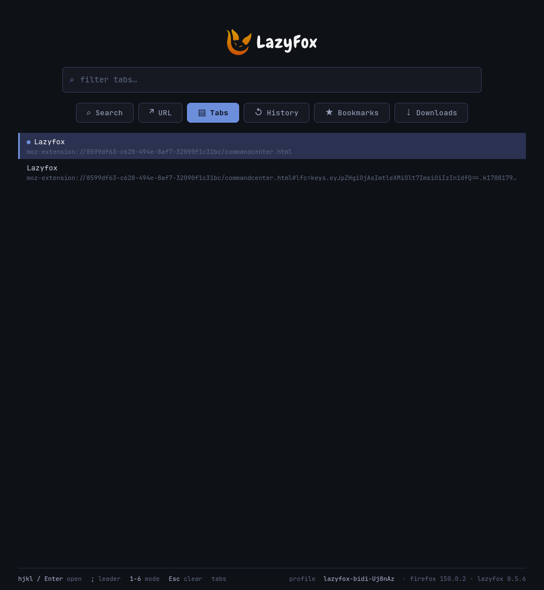
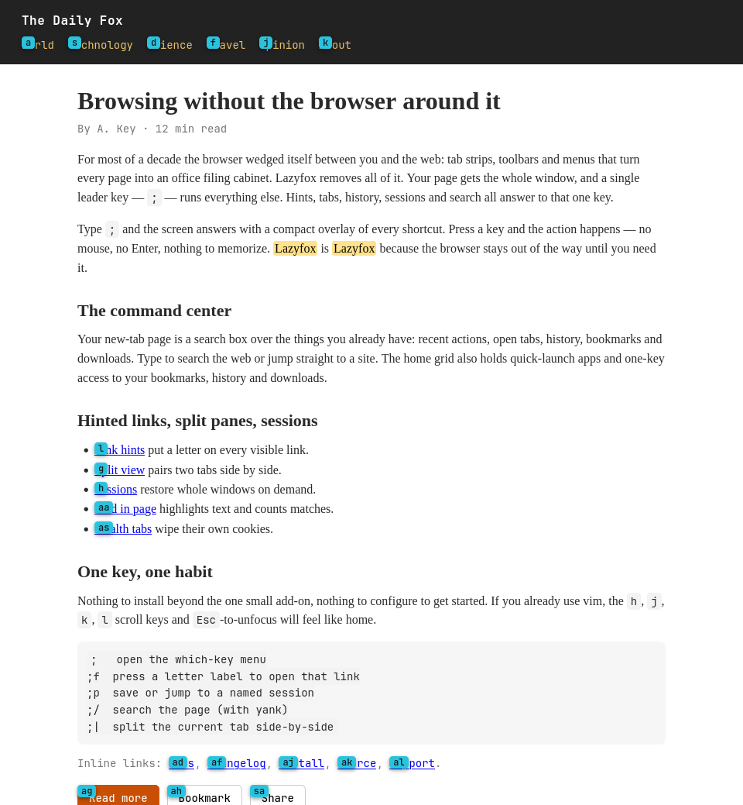
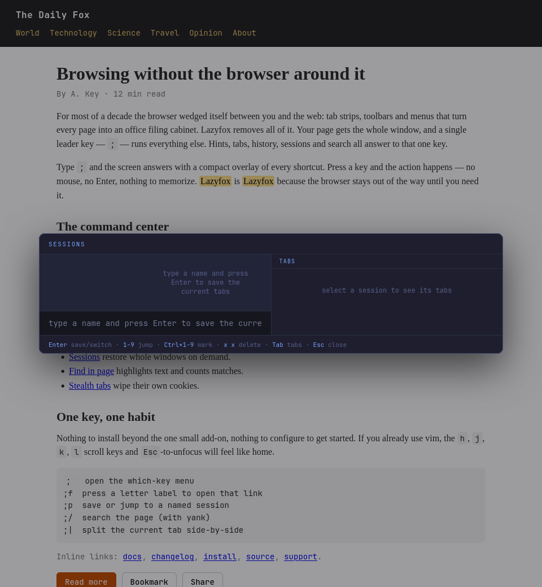
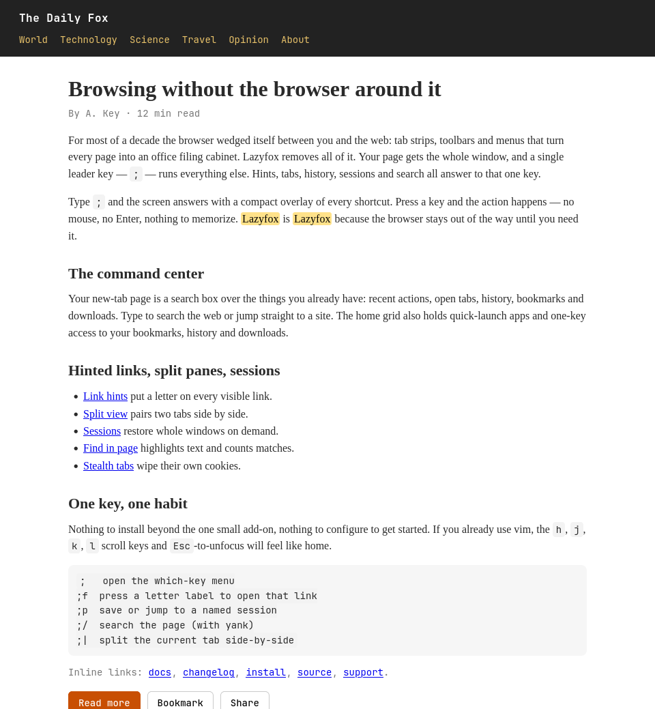

<p align="center">
  
</p>

# Lazyfox

**Firefox with the browsing UI stripped away — everything behind one key: `;`.**

<p align="center">
  
  
</p>

Lazyfox hides the tab strip, the URL bar and the menus. Your page gets the
whole window, with a slim status bar along the bottom that tells you where you
are. Everything else runs through one leader key: press `;`, a small menu of
bindings appears, press the key for what you want — and it happens. No mouse,
no `Enter`, nothing to memorize.

<p align="center">
  
</p>

## What's inside

- **Command center** — your new-tab page is a search box over recent actions,
  tabs, history, bookmarks and downloads.
- **Link hints** — every visible link gets a short label; type it and the
  link opens. Labels stay short because only what you can see gets one.
- **Find in page** — `;/` searches the page with a live match count, a
  highlight that survives page scripts, and neovim-style copy/yank of what
  you find. It works on framework pages where `Ctrl+F` gives up.
- **Sessions** — name your current window and switch between named ones; tabs
  and split layout come back exactly as you left them.
- **Split view** — two tabs side by side, without a window manager.
- **Stealth tabs** — isolated tabs that wipe their cookies and storage when
  they close. YouTube in a stealth tab won't know your account.
- **A status bar** — current session, place in the tab list, session pills,
  live download progress. It steps aside during fullscreen video.
- **Zen mode** — true fullscreen: the page fills the screen and the toolbar
  never peeks in.

The leader key works on internal pages too (`about:*`, error pages), so there
is always a way in. Those pages also get the vim scroll keys (`j`/`k`/`d`/`u`,
`gg`/`G`) and `Esc` unfocuses whatever input holds focus — so a focused
settings search box never blocks `;g` or the scroll keys.

## Install

Two halves make Lazyfox: the **add-on** (this repo's `dist/extension` — also
published on addons.mozilla.org as the signed `lazyfox2` add-on) and the
**profile patch** that physically removes the browser chrome. Firefox will not
let an add-on write files, so the profile patch is applied by a small installer.
The installer ships the **signed** add-on xpi and installs it verbatim, so both
setup paths work on **stable** Firefox — no Developer Edition or Nightly needed
(it is only required if you manually load a *unsigned* dev build from
`about:debugging`).

**From the store** — install `Lazyfox` from addons.mozilla.org, then press
`;I` (or open the extension's setup page). It detects the right profile,
writes the four `chrome/` files, merges Lazyfox's preferences, installs the
add-on, and asks for admin rights **once** to drop the autoconfig loader into
the Firefox install folder.

**The installer** — one prebuilt, cross-platform, **pure-Go** binary does the
whole install. There are **no shell or PowerShell scripts**; the binary itself
is the installer. It detects your OS, every Firefox installation and every
profile, then guides you through install or uninstall in an interactive
terminal wizard:

| OS | Distribution | Command / run |
| --- | --- | --- |
| Linux | GitHub Releases `lazyfox-install-linux` | `chmod +x lazyfox-install-linux` then run it |
| macOS | GitHub Releases `lazyfox-install-darwin` | run `lazyfox-install-darwin` |
| Windows | GitHub Releases `lazyfox-install-windows.exe` | double-click, or run from a terminal |

Downloads publish through the repo's **GitHub Releases** page; each build is
also committed under `installer/bin/` for direct use. Running the binary with
no arguments opens the interactive wizard and auto-detects your profile. To
skip the wizard and target a specific profile non-interactively (used by the
automated tests), pass it as a positional argument or a flag:

```
lazyfox-install                # interactive wizard (default)
lazyfox-install --mode list
lazyfox-install --mode install --profile "…" --firefox-dir "…"
lazyfox-install --mode uninstall --profile "…"
```

The installer finds your Firefox profile, copies the UI files, merges only the
preferences Lazyfox owns, and installs the add-on permanently. It also drops a
small helper into the Firefox install folder so the leader key works on pages
where add-ons cannot run — that one step asks for admin rights **once** (a UAC
prompt on Windows, `sudo` on Linux). Your profile, bookmarks, history and
settings are never touched; every file that gets replaced is backed up first.

## Development, testing & Nightly

Lazyfox develops against **Firefox Nightly**. Testing and manual smoke-tests
use the one installer binary with non-interactive flags (see above) so
everything is automatable. Nightly is used for both WebDriver (BiDi/Marionette)
test runs and for loading an *unsigned* dev build of the add-on from
`about:debugging` — stable Firefox rejects unsigned builds, so dev work happens
on Nightly, while released installs use the AMO-signed xpi on stable.

## Everyday use

### The leader key

Press `;` and a small overlay shows your bindings — a reminder, not a
gatekeeper. The action runs the moment you press its key; `Esc` just cancels.

| Keys | Action |
| --- | --- |
| `; f` | link hints (on the command-center home: hint-pick — every grid tile gets a letter, a key runs that tile) |
| `; s` / `; S` | web search (new tab / current tab) |
| `; o` / `; O` | open a URL (new tab / current tab) |
| `; t` | tab switcher — type to filter |
| `; p` | sessions popup |
| `; n` / `; x` / `; v` / `; c` | new tab / close / duplicate / reopen |
| `; V` | recently closed tabs & windows (restore one, or all) |
| `; j` / `; k` | next / previous tab |
| `; a` | alternate tab — jump to the last used tab and back |
| `; r` / `; g` / `; l` | reload / back / forward |
| `; y` / `; m` | copy URL / mute tab |
| `; z` | zen mode (fullscreen) |
| `; e` | toolbar reveal on hover |
| `; \|` | split side-by-side |
| `;[` / `;]` | previous / next split pane |
| `;{` / `;}` | swap panes left / right |
| `;+` then `1`–`9` | move that tab into the split |
| `; d` / `; h` / `; b` | downloads / history / bookmarks |
| `; /` | find in page — search, walk, copy (`y`) or yank (`Y`) |
| `; I` | full install — the setup page that completes the toolbar-free UI |
| `; N` | new stealth tab |
| `; Q` | save the session and quit Firefox |
| `; w` / `; m` | resize / move the window |
| `j` `k` `d` `u` `gg` `G` | scroll the page (when not typing) |
| `Ctrl+Alt+Space` / `Ctrl+Alt+K` | open the menu / command center from anywhere |

The history (`;h`) and recently-closed (`;V`) popups group entries by time —
Today, Yesterday, This week, This month, Earlier — with a hint letter on
each group header. `c` arms group toggling, then the hint letter
collapses/expands that group (`c` again toggles the group under the cursor);
`C` collapses all groups, `O` expands them, `g`/`G` jump to the top/bottom.
The popup footer always shows the keys for what you're doing at the moment.

### The command center

`Ctrl+T` (and the startup tab) opens the command center instead of a blank
new-tab page. It is keyboard-first: the home grid shows your quick-launch web
apps and the browser/settings access, and it opens in command mode —
`h`/`j`/`k`/`l` (or the arrows) move across the tiles, `Enter` runs the
selection, and `;` arms the leader right here (so `;I`, `;f`, `;n`, … all
work with no mouse click). Type any letter and the input takes over for a
search. `1`–`6` (or `Tab`) switch modes — Search · URL · Tabs · History ·
Bookmarks · Downloads — where `j`/`k` move through the list and `Enter` runs
it. `Esc` clears back to command mode.

<p align="center">
  
</p>

### Link hints

`;f` labels every visible link with a short key. Type the key and the link
opens — no mouse, no tabbing.

- Only links **in the current viewport** get labels, so keys stay short no
  matter how many links the page has.
- A hint fires once its letters are unambiguous; `Enter` picks the current
  prefix if you do not want to finish it.
- `]` / `[` (or `Tab` / `Shift+Tab`) page to the next / previous batch;
  typing a prefix whose link is below the fold scrolls it into view first.
- Hints cover buttons and custom widgets too, not just `<a>` tags.

<p align="center">
  
</p>

### Find in page

`;/` searches the page you're looking at. The widget sits in a corner
instead of the middle, so it never covers the text you're searching.

- Type to search: the **N/M** match count updates live on the widget and on
  the status bar (`0` in red means no matches yet). The search is
  framework-proof — it reads through open shadow roots (Reddit-style custom
  elements), matches words split across elements, treats `&nbsp;` and stray
  whitespace as one space, and reaches text nested dozens of levels deep —
  the pages where `Ctrl+F` finds nothing.
- `Enter` / `Shift+Enter` walk to the next / previous match. The first jump
  starts from where you are, not the top of the page. `Ctrl+o` steps back
  through every position you visited; `Esc` returns you to where you started
  the search. Matches are walked in **visual reading order** — top to
  bottom, left to right as the page renders — even when the site reorders
  blocks with CSS.
- After walking, the widget enters command mode and its hints switch:
  `n`/`N` walk · `y` copy · `Y` yank mode · `i` edit the query · `Esc`
  close. `y` copies the current match with an amber flash over the copied
  text.
- `Y` opens **yank mode**: a block cursor moves through the page's parsed
  text (`hjkl`, `w`/`b`/`e`, `0`/`$`, `g`/`G`), `y` starts a selection —
  highlighted live with a character count and a preview of exactly what
  will be copied — and `y` again yanks that range with the flash. `yy`
  yanks the whole line. Selections follow the page's content tree: menus,
  buttons, headers and footers are never part of what you copy. `Esc` steps
  back to the search, `i` edits the query.
- The highlight is Lazyfox's own overlay drawn in a shadow root — page
  scripts and clicks can't clear it, and it survives lazy-loading feeds.

### Sessions

Sessions are named snapshots of your window — tabs, split layout, everything.
Switch sessions and the whole window becomes that session; switch back and
the previous one is still there, untouched. Only one session is active at a
time, and the status bar shows which.

- **`;p`** opens the sessions popup: the session list on the left, the
  selected session's tabs on the right — look before you leap. Type to
  filter.
- Type a name that does not exist yet and the popup offers to **save the
  current tabs** under it or **start a clean empty session** — your current
  tabs stay exactly as they are either way.
- **`x x`** deletes the highlighted session — the first `x` arms a
  confirmation, the second one confirms. A stray keypress can never lose a
  session.
- **`;'`** then `1`–`9`, or **`Ctrl+1`–`9`**, jumps straight to a marked
  session.
- Sessions stay live: the current one re-saves itself as you open, close or
  rearrange tabs, so quitting — or even a crash — never loses tabs you added
  after saving. `;Q` saves and quits in one step.

<p align="center">
  
</p>

### The status bar

One slim strip at the bottom (top if you prefer), reading left to right:

1. the **current session**,
2. your **place in the tab list** (`3/7`),
3. your **saved sessions** as connected chevrons — `1:work 5 › 2:dev 3 › …`,
   each colored by its marker,
4. a **download segment** while something downloads — name, percent, speed,
   updating live. A finished download shows a green check, a failed one a red,
   and a click dismisses it from the bar (the file stays in the Downloads
   list).

The bar hides automatically when a page goes fullscreen — a video, for
example. Turn it off completely in settings if you prefer.

<p align="center">
  
</p>

**`;d`** opens the download list, prepopulated so there's nothing to search
for. Every entry shows the file name, its location, its state and live
progress. On the highlighted row: **`Enter`** opens the file, **`o`** shows it
in its folder, **`x x`** deletes it.

### Split view

`;|` puts the current tab side by side with the split panel — a search box
plus the live list of your other tabs, each row showing its `;+N` number.
Pick a tab and it lands in the split, replacing the panel, so no empty pane
is left behind.

- **`;[` / `;]`** switch the active pane.
- **`;{` / `;}`** swap the two panes.
- **`;+`** then `1`–`9` moves that tab straight into the split.
- **`;\\`** dissolves the split back into normal tabs.
- Splits are part of sessions: save a session while split, and restoring the
  session brings the whole layout back.

### Stealth tabs

**`;N`** opens a fresh stealth tab: isolated, empty, self-wiping. It is a
real Firefox container, so it has its own cookies and storage — open YouTube
in a stealth tab and you will not find your account there, and nothing it
stores leaks into your other tabs. Close it and its data is gone; if Firefox
quits before the cleanup runs, the orphan is caught and wiped at the next
launch.

You always know where you are: the status bar shows a dark-glasses badge, the
tab switcher (`;t`) marks the row, and the command center turns dark purple
inside a stealth tab.

### Settings

The settings page changes the leader key, the hint characters, whether
`j`/`k` scrolling is on, whether URL / history opens go to a new or the same
tab, and whether the status bar and the last-session restore run. Keys work
there too: `j`/`k` scroll, `;` opens the leader, `Esc` returns to the command
center.

## A note on limits

- The leader key lives in the add-on for regular pages and in a
  browser-level helper for everything else. Where neither runs,
  `Ctrl+Alt+Space` (or the mouse) is the way in.
- `Ctrl+Tab` is reserved by Firefox and cannot be intercepted; `;t` and
  `;j`/`;k` do the same job.
- User stylesheets are unofficial but widely used; internal names change
  occasionally, and the file is a few lines — easy to adjust.

## Development

Lazyfox is TypeScript with a Go/Wasm core compiled into every build. `dist/`
is committed, so installing never needs the toolchain — change source, run
`npm run build`, and reinstall or **Reload** in `about:debugging`.

```bash
npm install            # esbuild + typescript (+ toolchain check)
npm run build          # dev build: wasm, bundles, unsigned xpi — fast, no AMO
npm run dev-install    # build + install that dev build into Nightly/Devedition
npm run dev-install:clean  # …or first wipe stale dev profiles, then install
npm run ci             # run the whole local CI check before you push (never push to test CI)
npm run verify         # typecheck + full test suite, in one shot
npm test               # go test ./core/ + installer tests + dist/ completeness
```

> Prefer the concise walkthrough in **`docs/DEVELOPING.md`** (daily loop,
> publishing, releasing in one page) and **`docs/CI.md`** (running the exact CI
> checks locally so you never have to push to discover a broken workflow).

Daily loop: `npm run dev-install` (or `npm run dev-install:clean`) is all most
people need — it builds and installs the unsigned dev build into Firefox
Nightly/Devedition automatically. `npm run build` alone just makes the built
output.

**Dev vs signed builds.** Lazyfox has two build modes, and they are not the
same command — use the one that matches what you are doing:

| I want to… | Run | What it does |
|---|---|---|
| Develop / try the latest changes | `npm run build` | **Unsigned** dev build (`__DEV__=true`), fast, no AMO. Produces `dist/lazyfox2-<ver>.xpi` for Nightly/Devedition. |
| Install my fresh dev build into Nightly | `npm run dev-install` (or `npm run dev-install:clean`) | Builds + installs the unsigned dev xpi into a new profile. |
| Start a new version | `npm run bump -- X.Y.Z` | Bump the version everywhere at once. |
| Publish the next version to AMO | `npm run submit` | Packs the fresh build, uploads it to AMO as a **listed/public** version, and rebuilds the dev installers. Needs `AMO_API_KEY`/`SECRET` in `.env`. |
| **Ship the signed release** | **`npm run ship`** | **The whole release, from a dev branch**: merges dev into master (`-X theirs`), syncs the **AMO-signed** xpi, rebuilds the release installers, commits master, tags `v<version>`, pushes, and creates the GitHub Release. Run it after AMO review has signed the submitted version. |

**Signing.** Stable Firefox rejects unsigned add-ons, so the shipped xpi is the
**signed** one from addons.mozilla.org. AMO signs a **listed** (public) version
only *after* it is reviewed — submitting (`npm run submit`) uploads the xpi but
does not sign it instantly; it starts the review clock. Once AMO approves,
`npm run ship` does the rest in one command:

- `npm run submit` — uploads the fresh build to AMO (listed) → starts review.
- `npm run ship` — the release: merge to master, download the now-**signed** xpi
  (`scripts/sync-signed-xpi.ts`), embed it in the release installers, tag
  `v<version>` and create the GitHub Release.

`ship` is deterministic about the version (it always comes from
`src/static/extension/manifest.json`) and refuses to fake or guess a signed
xpi: it verifies the version is signed on AMO before touching git, then syncs
the exact version's signed xpi (reusing the committed signed artifact when it is
already current).

The full release flow (just `bump` → `submit` → wait → `ship`) is documented
in `docs/RELEASING.md`. CI is read-only on both branches: neither workflow
pushes, tags, or publishes — releases are created by `ship`, exactly once.

The end-to-end suite drives a real Firefox over WebDriver BiDi, and the
screenshots in this README are captured the same way:

```bash
node scripts/bidi/test.ts            # full run
node scripts/bidi/test.ts --group sessions
node scripts/bidi/screenshots.ts     # writes docs/img/*.png
```

Layout of the repo:

- `src/shared/` — types, config, popup engine, leader, status bar
- `src/chrome/` — the browser-level helper (toolbar-free browsing UI)
- `src/extension/` — the add-on: background, content script, command center
- `core/` — the Go core, compiled to Wasm and embedded in every bundle
- `docs/` — architecture notes, the release playbook, and screenshots. The
  release design is also documented *agnostically* in
  `docs/RELEASE-WORKFLOW-PATTERN.md`, so the pattern can be lifted into any
  project that has a pair of dev-vs-released branches.

## Uninstall

Run the same standalone installer with the `uninstall` action
(`installer/bin/lazyfox-install-linux --mode uninstall`, or use the wizard and
pick uninstall). It reverses exactly what the installer did — it removes the
Lazyfox extension from `extensions.json`, restores your profile/chrome/user.js
to the backed-up originals, and never touches your bookmarks, history or other
add-ons.

## License

MIT